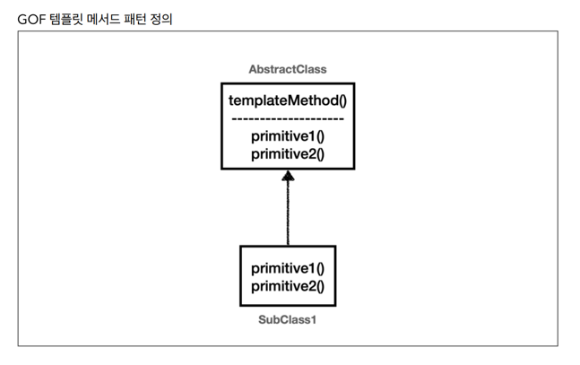
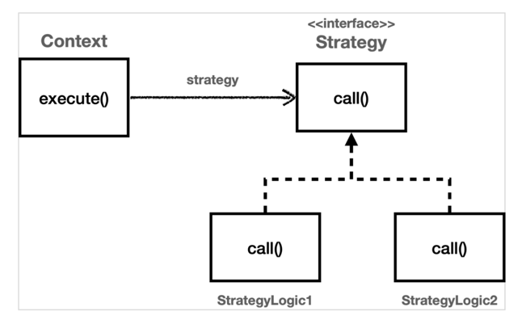

## 템플릿 메서드 패턴
- 템플릿 메서드 패턴은 이름 그대로 템플릿을 사용하는 방식이다.
- 템플릿이라는 틀에 변하지 않는 부분을 몰아둔다. 그리고 일부 변하는 부분은 별도로 홏루해서 해결한다.
> 템플릿 메서드 디자인 패턴의 목적은 다음과 같습니다.  
> "작업에서 알고리즘의 골격을 정의하고 일부 단계를 하위 클래스로 연기합니다.  
> 템플릿 메서드를 사용하면 하위 클래스가 알고리즘의 구조를 변경하지 않고도 알고리즘의 특정단계를 재정의할 수 있습니다." [GOF]

- 부모 클래스에 알고리즘의 골격인 템플릿을 정의하고, 일부 변경되는 로직은 자식 클래스에 정의하는 것이다.   
이렇게 하면 자식 클래스가 알고리즘의 전체 구조를 변경하지 않고, 특정 부분만 재정의할 수 있다. 결국 상속과 오버라이딩을 통한 다형성으로 문제를 해결하는 것이다.

**하지만**
템플릿 메서드 패턴은 상속을 사용한다. 따라서 상속에서 오는 단점들을 그대로 안고간다. 특히 자식클래스가 부모 클래스와 컴파일 시점에 강하게 결합되는 문제가 있다.  
이것은 의존관계에 대한 문제이다. 자식 클래스 입장에서는 부모 클래스의 기능을 전혀 사용하지 않는다.  
그럼에도 불구하고 템플릿 메서드 패턴을 위해 자식 클래스는 부모 클래스를 상속 받고 있다.

상속을 받는 다는 것은 특정 부모 클래스를 의존하고 있다는 것이다. 자식 클래스의 `extends` 다음에 바로 부모 클래스가 코드상에 지정되어 있다.  
따라서 부모 클래스의 기능을 사용하든 사용하지 않든 간에 부모 클래스를 강하게 의존하게 된다. 여기서 강하게 의존한다는 뜻은 자식 클래스의 코드에 부모 클래스의 코드가 명확하게 적혀 있다는 뜻이다.  
UML에서 상속을 받으면 삼각형 화살표가 `자식 -> 부모`를 향하고 있는 것은 이런 의존간계를 반영하는 것이다.

자식 클래스 입장에서는 부모 클래스의 기능을 전혀 사용하지 않는데, 부모 클래스르 알아야한다. 이것은 좋은 설계가 아니다. 그리고 이런 잘못된 의존관계 때문에 부모클래스를 수정하면 자식클래스에도 영향을 줄 수 있다.

## 전략 패턴

GOF 디자인 패턴에서 정의한 전략 패턴의 의도는 다음과 같다.
> 알고리즘 제품군을 정의하고 각각을 캡슐화하여 상호 교환 가능하게 만들자. 전략을 사용하면 알고리즘을 사용하는 클라이언트와 독립적으로 알고리즘을 변경할 수 있다.

## 템플릿 콜백 패턴
> **콜백 정의**  
> 프로그래밍에서 콜백(callback) 또는 콜애프터 함수(call-after function)는 다른 코드의 인수로서 넘겨주는 실행 가능한 코드를 말한다.  
> 콜백을 넘겨받는 코드는 이 콜백을 필요에 따라 즉시 실행할 수도 있고, 아니면 나중에 실행할 수도 있다.
